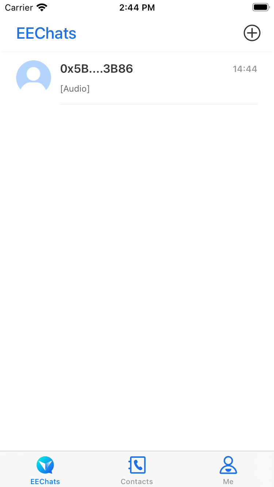
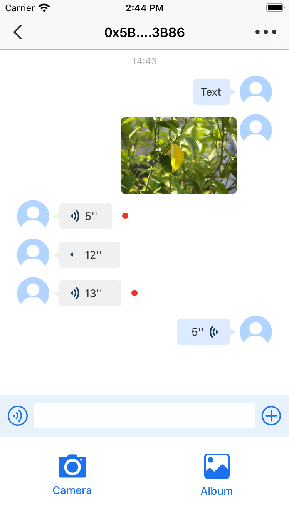
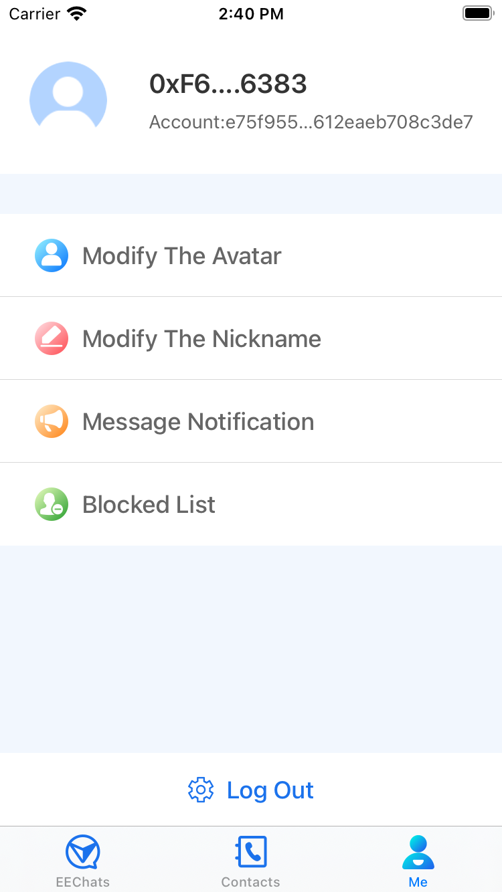

# EEChat: OpenIM Messaging Client for iOS

iOS client for [OpenIM](https://github.com/OpenIMSDK/Open-IM-Server) in Swift.

Status: beta. Usable and mostly stable but bugs may happen.


## Features

### Completed

* Login
* Register new accounts.
* Start new chats.
* Edit personal details.
* Edit chat parameters.
* View the list of active chats
* Send and receive plain text messages one-on-one or in group chats.
* In-app presence notifications.
* Unread message counters.
* Local data persistence.
* Transport Level Security - https/wss.
* Viewing attachments and inline images.
* Delivery and received/read indicators for messages (little check marks in messages).
* Muting/un-muting conversations and other permission management.
* Push notifications.
* Attachments and inline images.

### Not Done Yet

* Group chats.

* Previews not generated for videos, audio, links or docs.
* Typing indicators.
* No support for switching between multiple backends.
* Mentions, hashtags.
* Replying or forwarding messages.
* End-to-End encryption.


## Screenshots




## Installation

### [CocoaPods](https://cocoapods.org/) **Recommended**

```ruby
# Swift 5.3
pod 'OpenIM', git: "https://github.com/OpenIMSDK/Open-IM-SDK-iOS.git" #, :commit => ''
pod 'OpenIMUI', git: "https://github.com/OpenIMSDK/Open-IM-SDK-iOS.git" #, :commit => ''
```

Copy `MessagesVC.swift` to your project

Implement your `file upload` in 
```swift
func upload(files: [Any], callback: @escaping ([String]) -> Void)
```

Realize `photo selector` and `camera` in 

```swift
func inputBarMoreView(_ inputBarMoreView: InputBarMoreView, didSelect index: Int)
```

Implement message `long press` event in

```swift
func collectionView(_ collectionView: UICollectionView, shouldShowMenuForItemAt indexPath: IndexPath) -> Bool
```


## Requirements

- **iOS 11** or later
- **Swift 5.3** or later


## OpenIM

### Login

```swift
OpenIMManager.shared.login(model: tokenModel)
```


### Send a message 

[SessionType](https://github.com/OpenIMSDK/Open-IM-SDK-iOS/blob/93eb732a84c37d376f9e281841035f5379152516/OpenIM/Source/Socket/Model/Enum.swift#L10) [ContentType](https://github.com/OpenIMSDK/Open-IM-SDK-iOS/blob/93eb732a84c37d376f9e281841035f5379152516/OpenIM/Source/Socket/Model/Enum.swift#L85)

```swift
OpenIMManager.shared.send(sessionType, content: contentType)
```


